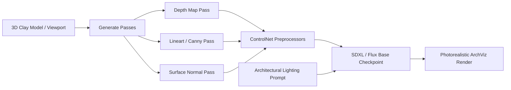

# ComfyUI & ArchViz ControlNet Rendering Skill

## Overview
Turns 3D massing, clay renders, or Three.js/Blender exports into photorealistic architectural visualizations while strictly preserving the geometric layout, window locations, and volume.

## Rendering Pipeline

## Architectural Prompt Guidelines
- **Perspective & Medium:**
  `"Architectural photograph, eye-level street view, 35mm lens, sharp focus, magazine feature in Architectural Digest"`
- **Materials:**
  `"Smooth board-formed concrete walls, natural vertical cedar wood slats, floor-to-ceiling ultra-clear low-iron glazing, brushed dark bronze mullions"`
- **Lighting & Atmosphere:**
  `"Late afternoon golden hour sunlight, long warm shadows, subtle warm interior lighting glowing through large windows, clear sky with wisps of cirrus clouds"`
- **Environment:**
  `"Manicured minimalist modern landscape, gravel pathways, ornamental grasses, olive trees, wet tarmac reflecting warm light"`
- **Negative Prompt:**
  `"blurry, warped windows, bent walls, bad architecture, unrealistic perspective, distorted lines, oversaturated, CGI artifact, noisy"`
